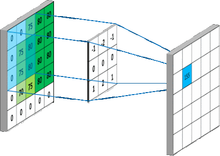

<div id="top"></div>
<!--
*** Thanks for checking out the Best-README-Template. If you have a suggestion
*** that would make this better, please fork the repo and create a pull request
*** or simply open an issue with the tag "enhancement".
*** Don't forget to give the project a star!
*** Thanks again! Now go create something AMAZING! :D
-->


<!-- PROJECT SHIELDS -->
<!--
*** I'm using markdown "reference style" links for readability.
*** Reference links are enclosed in brackets [ ] instead of parentheses ( ).
*** See the bottom of this document for the declaration of the reference variables
*** for contributors-url, forks-url, etc. This is an optional, concise syntax you may use.
*** https://www.markdownguide.org/basic-syntax/#reference-style-links
-->
<!-- [![Contributors][contributors-shield]][contributors-url]
[![Forks][forks-shield]][forks-url]
[![Stargazers][stars-shield]][stars-url] 
[![LinkedIn][linkedin-shield]][linkedin-url]
-->
[![Issues][issues-shield]][issues-url]
[![MIT License][license-shield]][license-url]


<!-- PROJECT LOGO -->
<br />
<div align="center">
  <a href="https://github.com/Bhartendu-Kumar/DIP">
    
  </a>
  
  
 
<h3 align="center">Exploring Blind Preprocessing to Improve Viola-Jones</h3>

  <p align="center">
    We are interested in studying the impact of applying various pre-processing methods on the detection efficiency of Viola-Jones detector. The pre-processing has to be blind so to be applied in all scenarios and still we do get better performance. 
    <br />
    <a href="https://github.com/Bhartendu-Kumar/DIP"><strong>Explore the docs »</strong></a>
    <br />
    <br />
    <a href="https://github.com/Bhartendu-Kumar/DIP">View Demo</a>
    ·
    <a href="https://github.com/Bhartendu-Kumar/DIP">Report Bug</a>
    ·
    <a href="https://github.com/Bhartendu-Kumar/DIP">Request Feature</a>
  </p>
</div>


   
    


<!-- TABLE OF CONTENTS -->
<details>
  <summary>Table of Contents</summary>
  <ol>
    <li>
      <a href="#about-the-project">About The Project</a>
      <ul>
        <li><a href="#built-with">Built With</a></li>
      </ul>
    </li>
    <li>
      <a href="#getting-started">Getting Started</a>
      <ul>
        <li><a href="#prerequisites">Prerequisites</a></li>
        <li><a href="#installation">Installation</a></li>
      </ul>
    </li>
    <li><a href="#usage">Usage</a></li>
    <li><a href="#roadmap">Roadmap</a></li>
    <li><a href="#contributing">Contributing</a></li>
    <li><a href="#license">License</a></li>
    <li><a href="#contact">Contact</a></li>
    <li><a href="#acknowledgments">Acknowledgments</a></li>
  </ol>
</details>


<!-- ABOUT THE PROJECT -->
## About The Project

[![Product Name Screen Shot][product-screenshot]](https://example.com)


Here's a blank template to get started: To avoid retyping too much info. Do a search and replace with your text editor for the following: `Bhartendu-Kumar`, `DIP`, `twitter_handle`, `linkedin_username`, `email`, `email_client`, `project_title`, `project_description`

<p align="right">(<a href="#top">back to top</a>)</p>


### Built With

* [Next.js](https://nextjs.org/)
* [React.js](https://reactjs.org/)
* [Vue.js](https://vuejs.org/)
* [Angular](https://angular.io/)
* [Svelte](https://svelte.dev/)
* [Laravel](https://laravel.com)
* [Bootstrap](https://getbootstrap.com)
* [JQuery](https://jquery.com)

<p align="right">(<a href="#top">back to top</a>)</p>


<!-- GETTING STARTED -->
## Getting Started

This is an example of how you may give instructions on setting up your project locally.
To get a local copy up and running follow these simple example steps.

### Prerequisites

This is an example of how to list things you need to use the software and how to install them.
* npm
  ```sh
  npm install npm@latest -g
  ```

### Installation

1. Get a free API Key at [https://example.com](https://example.com)
2. Clone the repo
   ```sh
   git clone https://github.com/Bhartendu-Kumar/DIP.git
   ```
3. Install NPM packages
   ```sh
   npm install
   ```
4. Enter your API in `config.js`
   ```js
   const API_KEY = 'ENTER YOUR API';
   ```

<p align="right">(<a href="#top">back to top</a>)</p>


<!-- USAGE EXAMPLES -->
## Usage

Use this space to show useful examples of how a project can be used. Additional screenshots, code examples and demos work well in this space. You may also link to more resources.

_For more examples, please refer to the [Documentation](https://example.com)_

<p align="right">(<a href="#top">back to top</a>)</p>


<!-- ROADMAP -->
## Roadmap

- [] Feature 1
- [] Feature 2
- [] Feature 3
    - [] Nested Feature

See the [open issues](https://github.com/Bhartendu-Kumar/DIP/issues) for a full list of proposed features (and known issues).

<p align="right">(<a href="#top">back to top</a>)</p>


<!-- CONTRIBUTING -->
## Contributing

Contributions are what make the open source community such an amazing place to learn, inspire, and create. Any contributions you make are **greatly appreciated**.

If you have a suggestion that would make this better, please fork the repo and create a pull request. You can also simply open an issue with the tag "enhancement".
Don't forget to give the project a star! Thanks again!

1. Fork the Project
2. Create your Feature Branch (`git checkout -b feature/AmazingFeature`)
3. Commit your Changes (`git commit -m 'Add some AmazingFeature'`)
4. Push to the Branch (`git push origin feature/AmazingFeature`)
5. Open a Pull Request

<p align="right">(<a href="#top">back to top</a>)</p>


<!-- LICENSE -->
## License

Distributed under the MIT License. See `LICENSE.txt` for more information.

<p align="right">(<a href="#top">back to top</a>)</p>


<!-- CONTACT -->
## Contact

Your Name - [@twitter_handle](https://twitter.com/twitter_handle) - email@email_client.com

Project Link: [https://github.com/Bhartendu-Kumar/DIP](https://github.com/Bhartendu-Kumar/DIP)

<p align="right">(<a href="#top">back to top</a>)</p>


<!-- ACKNOWLEDGMENTS -->
## Acknowledgments

* []()
* []()
* []()

<p align="right">(<a href="#top">back to top</a>)</p>


<!-- MARKDOWN LINKS & IMAGES -->
<!-- https://www.markdownguide.org/basic-syntax/#reference-style-links -->
[contributors-shield]: https://img.shields.io/github/contributors/Bhartendu-Kumar/DIP.svg?style=for-the-badge
[contributors-url]: https://github.com/Bhartendu-Kumar/DIP/graphs/contributors
[forks-shield]: https://img.shields.io/github/forks/Bhartendu-Kumar/DIP.svg?style=for-the-badge
[forks-url]: https://github.com/Bhartendu-Kumar/DIP/network/members
[stars-shield]: https://img.shields.io/github/stars/Bhartendu-Kumar/DIP.svg?style=for-the-badge
[stars-url]: https://github.com/Bhartendu-Kumar/DIP/stargazers
[issues-shield]: https://img.shields.io/github/issues/Bhartendu-Kumar/DIP.svg?style=for-the-badge
[issues-url]: https://github.com/Bhartendu-Kumar/DIP/issues
[license-shield]: https://img.shields.io/github/license/Bhartendu-Kumar/DIP.svg?style=for-the-badge
[license-url]: https://github.com/Bhartendu-Kumar/DIP/LICENSE.txt
[linkedin-shield]: https://img.shields.io/badge/-LinkedIn-black.svg?style=for-the-badge&logo=linkedin&colorB=555
[linkedin-url]: https://linkedin.com/in/linkedin_username
[product-screenshot]: images/lena.gif


# DIP
DIP project

DataSets:
1. MIT CBCL
2. BioID
3. Yale
4. Caltech
5. SoF
6. Orl
7. Non - Face Dataset (Collected Heterogeneously)

----------------------------------------------------------------------------------------
Pre-Processing Methods Studied:
* Low Pass Filters:

1. gaussian blur
2. bilateral filter


* Deconvolutions
1. Blind Deconvolution (richardson lucy)
2. tv_chambolle
3. BMD (partially implemented , not converging yet)

* Retinex

1. SSR
2. MSR
3. retinex FM
4. NMBM

* Normalization

1. HOMO

* Histogram Manipulation

1. CLAHE
2. HE
3. log intensity stretch
4. full scale intensity stretch
----------------------------------------------------------------------------------------

The pipeline is as:


Step 1: Download the DataSets (from their owner sites) and use the scripts in the dataset_helper_scripts directory to convert all to greyscale and change extensions like (.gif and .pgm) to common extensions. Also arrange all images of a dataset in a single folder using these scripts.

Step 2: Arrange the data   directory like shown
has 2 subdirectories: faces     non-faces
These further have their particular sub-directories with name of the DATASET


----! Important, for illuastration "data" folder has the desired structure, just that it has few images 

Step 3: Run all the "driver scripts" in the root directory of this repository.
This will create an "output" directory with the result of all preprocessing methods.

Step 4: Use "csv_scripts" directory to get the performance metrics from the "output" directory

Step 5: "analysis" directory has the final performance csv files of each pre-procesing method

Step 6: Published report  directory has the final findings in form of csv file.

